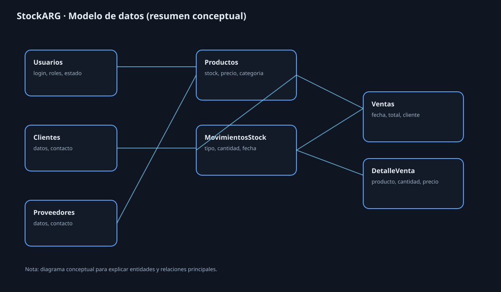

# StockARG

Sistema de gestion de stock, ventas y clientes con UI en Tkinter y base MySQL.

## Que resuelve
- Unifica stock, ventas y clientes para reducir errores de planillas.
- Da trazabilidad de movimientos y reportes para control diario.

## Stack
- Python 
- Tkinter
- MySQL 

## Modulos
- Login (email + Google opcional)
- Clientes / Proveedores / Productos
- Ventas + DetalleVenta
- Movimientos de stock
- Reportes CSV/PDF
- Panel de estado

## Arquitectura
- UI (Tkinter)
- Logica de negocio
- Persistencia (MySQL)
- Migraciones SQL en `db_migrations/`

## Modelo de datos
Ver diagrama: `docs/StockARG-ERD.svg`

Entidades principales:
- Clientes
- Proveedores
- Productos
- Ventas
- DetalleVenta
- MovimientosStock
- Usuarios

## Reglas de integridad
- No permitir venta con stock insuficiente.
- Validar cantidades y precios positivos.
- Evitar duplicados de productos/codigos.
- Registrar movimientos por alta/venta/ajuste.

## Edge cases cubiertos
- Bloqueo de venta sin stock.
- Control de duplicados.
- Manejo de errores en exportacion.

## Instalacion
1. Crear BD MySQL y usuario.
2. Configurar credenciales en `Conexion.py`.
3. Ejecutar migraciones en `db_migrations/`.
4. `pip install -r requirements.txt`
5. `python Main.py`

## PDF (opcional)
`pip install -r requirements-optional.txt`

## Testing (opcional)
`pip install -r requirements-dev.txt`

`pytest -q`

## Capturas

## Roadmap corto
- Roles y permisos.
- Auditoria de movimientos.
- Importacion CSV masiva.
- Tests basicos de validacion.

## Notas de seguridad
No subir `email.env` ni `client_secret.json`.
